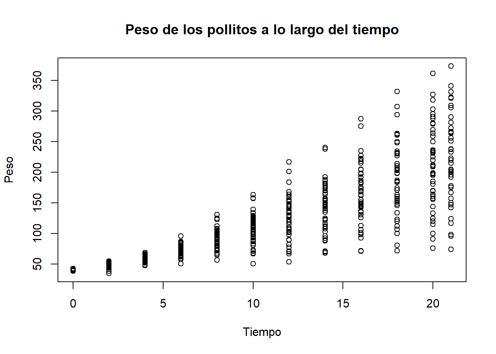

## Introducción

El dataset ChickWeight contiene información sobre el crecimiento
de diferentes pollitos alimentados con distintas dietas.

## Primer análisis

```r
data("ChickWeight")
head(ChickWeight)
```

```
##   weight Time Chick Diet
## 1     42    0     1    1
## 2     51    2     1    1
## 3     59    4     1    1
## 4     64    6     1    1
## 5     76    8     1    1
## 6     93   10     1    1
```

```
##      weight           Time           Chick     Diet   
##  Min.   : 35.0   Min.   : 0.00   13     : 12   1:220  
##  1st Qu.: 63.0   1st Qu.: 4.00   9      : 12   2:120  
##  Median :103.0   Median :10.00   20     : 12   3:120  
##  Mean   :121.8   Mean   :10.72   10     : 12   4:118  
##  3rd Qu.:163.8   3rd Qu.:16.00   17     : 12          
##  Max.   :373.0   Max.   :21.00   19     : 12          
##                                  (Other):506
```
El dataset contiene 578 observaciones y
4 variables


```r
plot(ChickWeight$Time, ChickWeight$weight,
     main = "Peso de los pollitos a lo largo del tiempo",
     xlab = "Tiempo",
     ylab = "Peso")
```



